# ERP System – Imajica Aesthetic  
*A Web-based ERP System for Imajica Aesthetics*

## Overview
A custom ERP solution designed for aesthetic clinics, providing streamlined operations, real-time tracking, and role-based access for staff.

## Features
- **Inventory tracking**: Real-time monitoring of cosmetic products.  
- **Appointment scheduling**: Automated reminders for clients.  
- **Client management**: Profiles with treatment history.  
- **Revenue analytics**: Reporting and dashboard insights.  
- **POS system**: In-clinic sales and inventory updates.  
- **Installment tracking**: Payment management for high-value treatments.  
- **Custom packages**: Flexible promotions and bundles.  
- **Role-based access**: Permissions tailored to staff responsibilities.  
## 📸 Screenshots

<table>
  <tr>
    <td>
      <strong>Authentication</strong> 
      User login and secure access.
       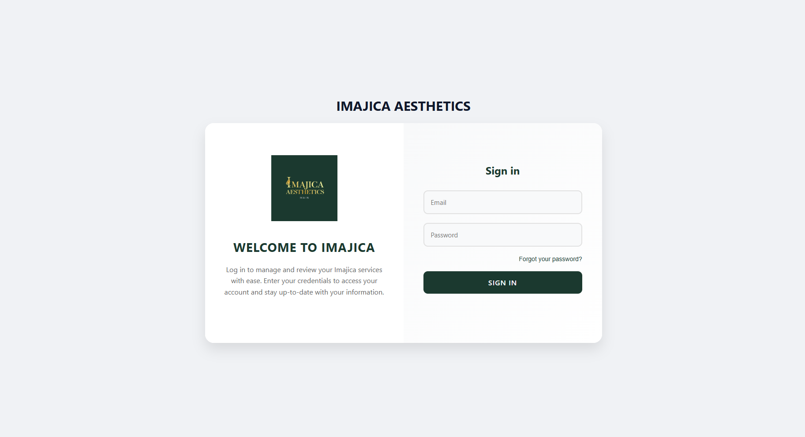
    </td>
    <td>
      <strong>Dashboard View</strong> 
      Overview of sales, expenses, and client highlights.
       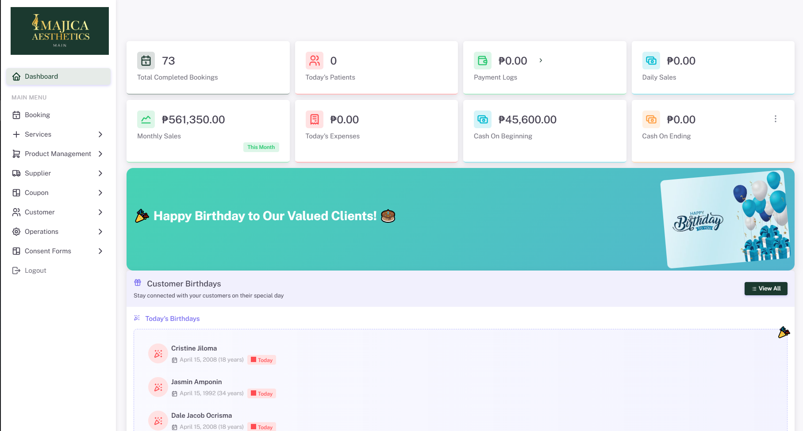
    </td>
  </tr>
  <tr>
    <td>
      <strong>Booking Management / POS</strong> 
      Service selection and in‑clinic sales interface.
       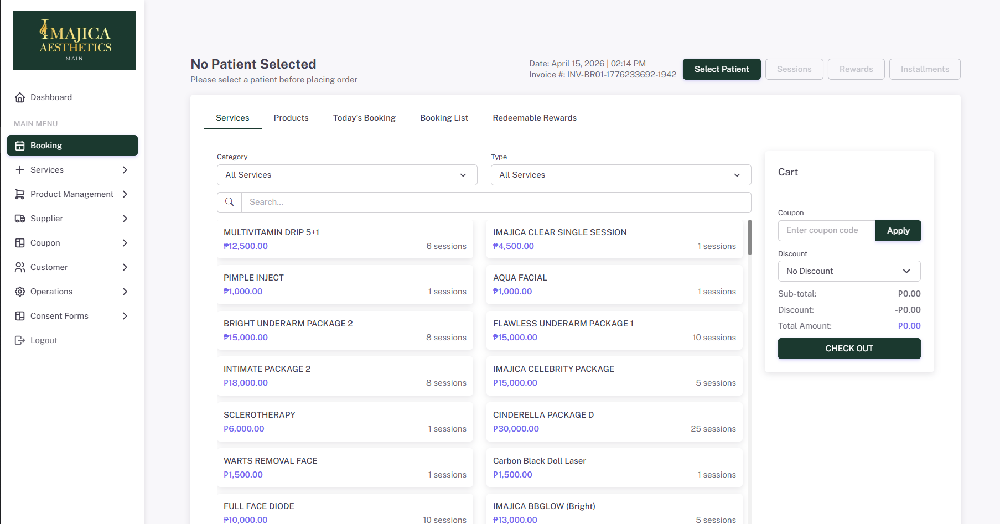
    </td>
    <td>
      <strong>Patient Installment Tracking</strong> 
      Manage payment installments for treatments.
       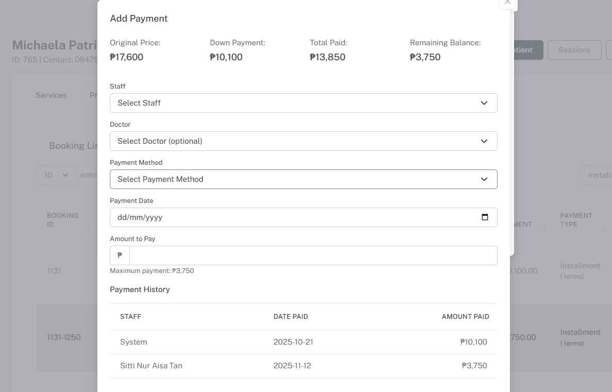
    </td>
  </tr>
  <tr>
    <td>
      <strong>Patient Sessions</strong> 
      Track treatment sessions and client progress.
       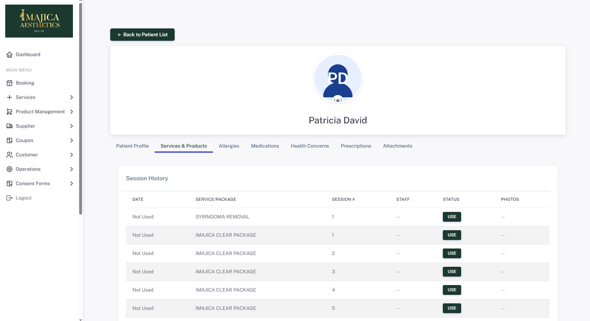
    </td>
  <td>
      <strong>Sales</strong> 
      Track Sales from different Imajica Branches
       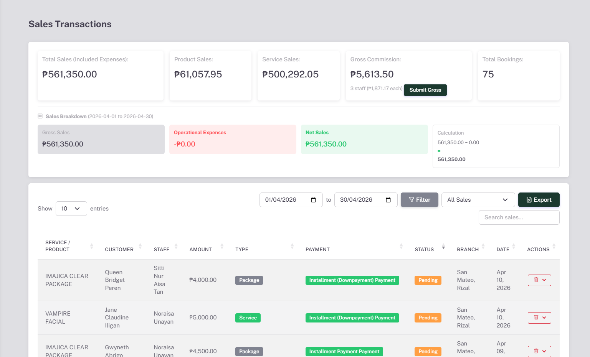
    </td>
  </tr>

  <tr>
    <td>
      <strong>Best Selling Products</strong> 
      Track Best Selling Products
       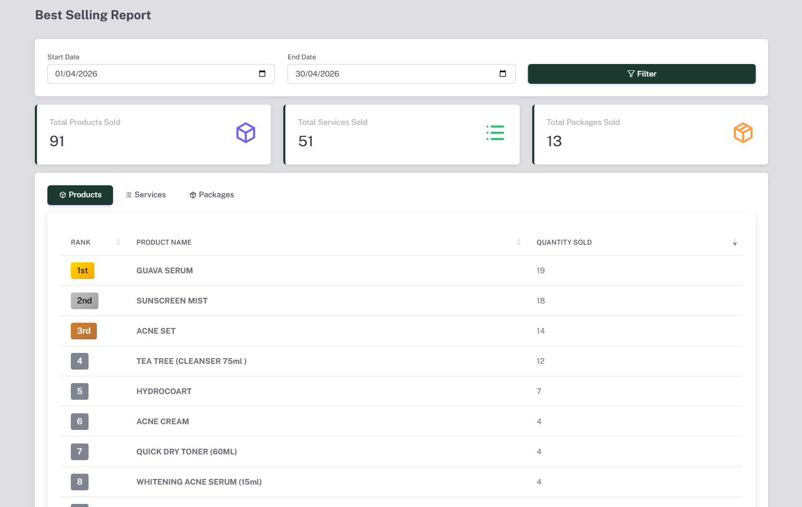
    </td>
  <td>
      <strong>Paperless Forms</strong> 
       To maximize the use of website and avoid paper-forms
       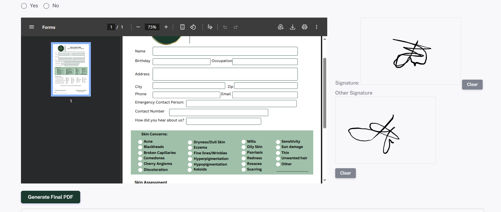
    </td>
  </tr>

  <tr>
    <td>
      <strong>Staff Commissions</strong> 
      Track Product Commissions of Imajica Staffs
       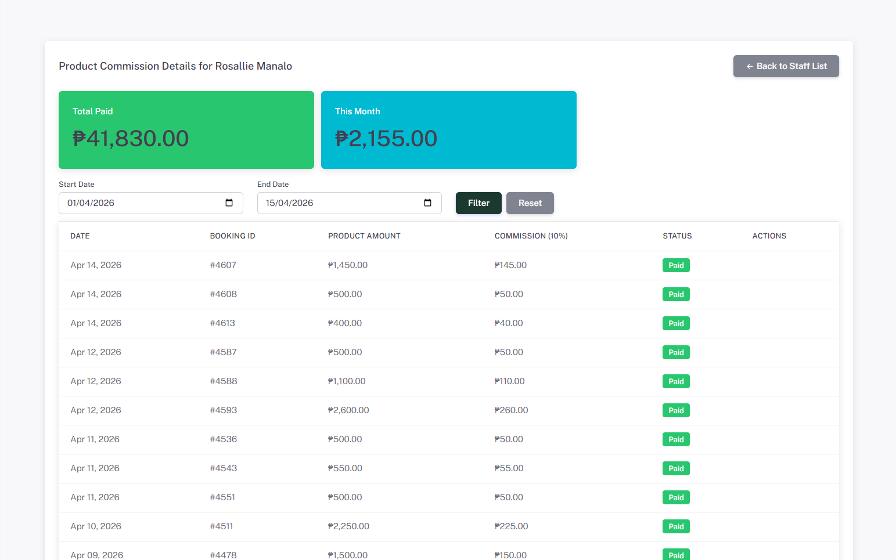
    </td>
  <td>
      <strong>Expired Products</strong> 
       To check expired products
       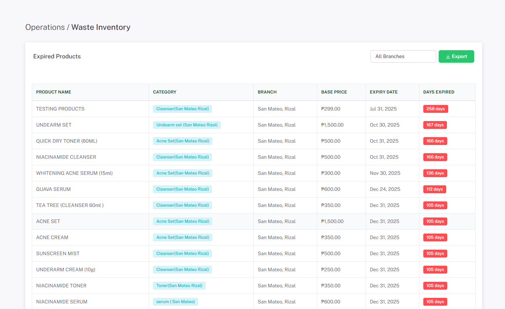
    </td>
  </tr>

  <tr>
    <td>
      <strong>Cashflow Calendar</strong> 
      Track Expenses through calendar view
       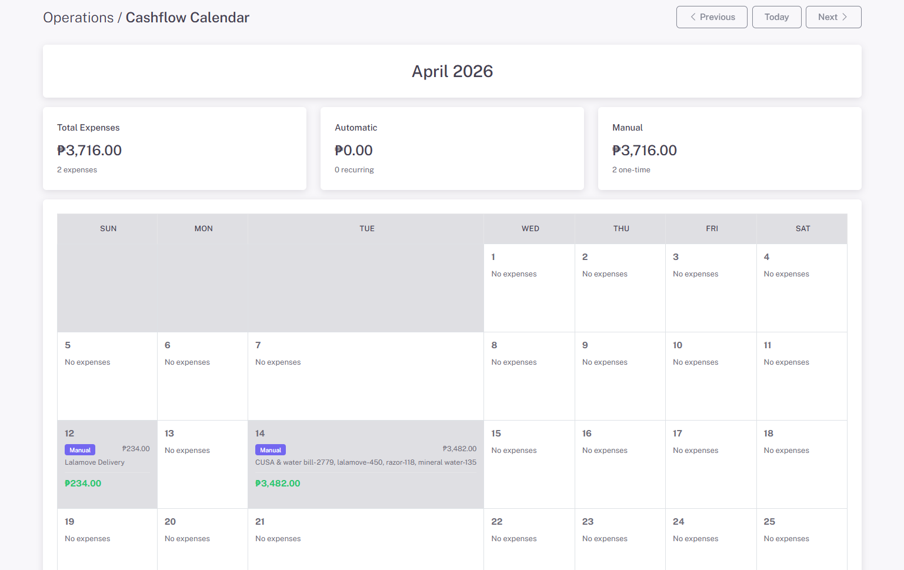
    </td>
  <td>
      <strong>Expenses Management</strong> 
       Expenses that deducts to Imajica's Monthly Sales
       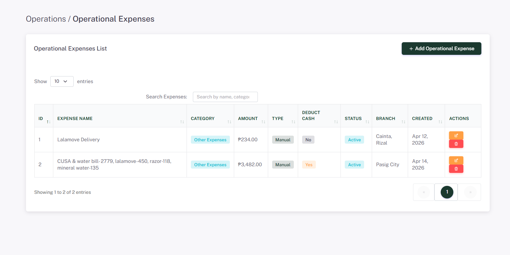
    </td>
  </tr>

</table>
